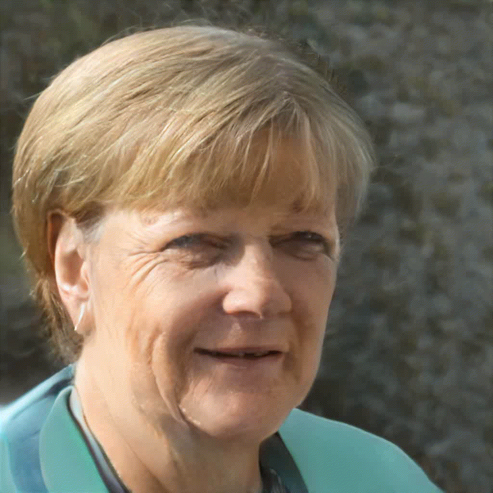
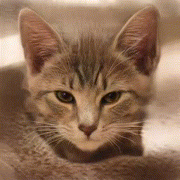
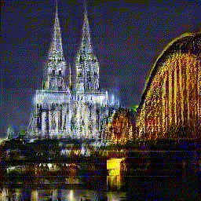

# HR_Encoder - find your own images in StyleGAN2

The  [StyleGAN2](https://arxiv.org/abs/1912.04958) model is is capable of generating natural looking images out of (almost) nothing - even images that haven't been discovered yet. HR_Encoder extends Alberto Rosas Garcia's unofficial [StyleGAN2-Tensorflow-2.x implementation](https://github.com/rosasalberto/StyleGAN2-TensorFlow-2.x) to find your own images in StyleGAN2's *W* space.

**Legal information**

*HR_Encoder.ipynb*, *HR_Encoder.py* and *w_utilities.py* are **Copyright © 2020 [HANS ROETTGER](mailto:oss.roettger@posteo.org)**
and distributed under the terms of **[GNU AGPLv3](https://www.gnu.org/licenses/agpl-3.0.html)**.

**Severability** clause: If a provision of the [GNU AGPLv3](https://www.gnu.org/licenses/agpl-3.0.html) is or becomes illegal, invalid or unenforceable in any jurisdiction, that shall not affect: 
1. the validity or enforceability in that jurisdiction of any other provision of the GNU AGPLv3; or 
2. the validity or enforceability in other jurisdictions of that or any other provision of the GNU AGPLv3.

**⚠️ Warning**: HR_Encoder makes heavy use of your hardware via the [tensorflow2](https://www.tensorflow.org/) libraries. Pay attention to adequate ventilation/ cooling and take all necessary precautions to prevent overload, overheating or consequential damage according to the recommendations of your hardware provider.

**All images** used to showcase HR_Encoder are copyrighted by their respective owners and were licensed by them [CC0](https://creativecommons.org/publicdomain/zero/1.0/deed.en)/ PD/ [pixabay](https://pixabay.com/service/license/): [1](https://de.m.wikipedia.org/wiki/Datei:Angela_Merkel_(2016-09-16_BRATISLAVA_SUMMIT).jpg)
[2](https://www.maxpixel.net/Che-Red-Revolution-Silhouette-Stripes-Guevara-158841)
[3](https://commons.wikimedia.org/wiki/File:Der_Samtrote_Sonderk%C3%A4fer.jpg)
[4](https://pixabay.com/photos/ferrari-488-ferrari-488-gtb-4345304/)
[5](https://pixnio.com/fauna-animals/cats-and-kittens/cat-kitten-pet-cute-animal-portrait-sleep-textil-fur)
[6](https://www.maxpixel.net/Cologne-Cathedral-Dom-Bridge-Cologne-Church-1111696)
[7](https://commons.wikimedia.org/wiki/File:Karl_Volkers_-_Portrait_of_a_Jockey_on_his_Horse.jpg)

<table border="5" akign=<"center">
<tr>
    <td>
        <table border="0">
            <tr></img></tr>
            <tr></img></tr>
        </table>
    </td>
    <td></img></td>
    <td>
        <table border="0">
            <tr></img></tr>
            <tr></img></tr>
        </table>
    </td>
</tr>
</table>

**Examples shown above** are generated in the jupyter notebook. First column visualizes encoding of a portrait and ease of manipulation in *W* space (sunglasses added / image style changed). Middle shows the result of morphing in *W* space. Finally encoding results for further StyleGAN2 domain models.

### In a nutshell, [(High Resolution) HR_Encoder](https://github.com/oss-roettger/HR_Encoder) calculates StyleGAN2 latent codes *w&#8407;∈W* for your images
>## 🐱 ➡️` HR_Encoder `↘️ 
>## &nbsp;&nbsp;&nbsp;&nbsp;&nbsp; (random) *z&#8407;*&nbsp; ➡️ &nbsp;&nbsp;*w&#8407;*&nbsp; ➡️` StyleGAN2 Generator `➡️ 🐱 
### ... and StyleGAN2 generates natural looking images from your (manipulated) latent codes *w&#8407;*

**What for?** HR_Encoder transfers your images into StyleGAN2's *W* space and enables you to apply [state of the art image manipulation](https://www.youtube.com/watch?v=9QuDh3W3lOY) to your own material. Simple computations on latent codes *w&#8407;∈W* create [fantastic effects](https://www.youtube.com/watch?v=jdTICDa_eAI) in the StyleGAN2-generated images.

**What is new?** In contrast to Dmitry Nikitko's [original encoder](https://github.com/Puzer/stylegan-encoder), HR_Encoder uses the StyleGAN2 discriminator model itself instead of the VGG16 model to preserve high level image features during encoding - resulting in latent codes *w&#8407;* for very sharp and detailed images.  
BTW: this approach leads to a more consice algorithm without need of complicated image similarity metrics.

**Is the encoding lossless?** No, not at all. But StyleGAN2 generates naturally looking images very similar to your input images, although details might be missing or could be artificially invented.

**Requirements?** HR_Encoder requires a [tensorflow2/Jupyter](https://www.tensorflow.org/install) environment and uses up to 8 GB of RAM or GPU memory. It is possible to run the algorithms on a CPU without Nvidia GPU/ Cuda support - although it takes plenty of time (see run time estimations in the model descriptions).

## Installation

    # get Alberto Rosas Garcia's StyleGAN2 implementation
    git clone https://github.com/rosasalberto/StyleGAN2-TensorFlow-2.x.git

    # from https://drive.google.com/drive/folders/1rhuvN90EGsRhvjQq5gio8VYw7f0LojaK?usp=sharing
    # download the StyleGAN2 models (all files) to ./StyleGAN2-TensorFlow-2.x/weights/

    # get HR_encoder
    git clone https://github.com/oss-roettger/HR_Encoder.git

    # copy HR_Encoder files to the StyleGAN2 directory
    # !!! stylegan2_discriminator.py was modified and will be replaced
    \cp -rf ./HR_Encoder/* ./StyleGAN2-TensorFlow-2.x/

    # Recommendation: run the project in a docker container preconfigured for tensorflow2  -e.g. w/o GPU:
    /usr/bin/docker run -it --rm -v $(realpath ./StyleGAN2-TensorFlow-2.x):/tf/HR_Encoder -p 8888:8888 tensorflow/tensorflow:2.1.1-jupyter 

    # Finally: start HR_Encoder.ipynb [Kernal/Restart & Run All]
